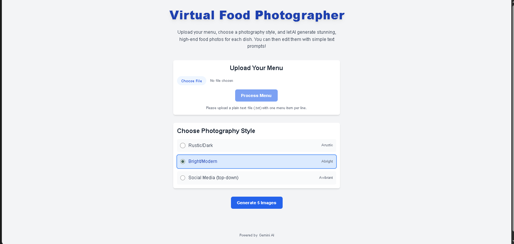

# Virtual Food Photographer

Generate restaurant food photos from your menu using the Gemini API.  
Built with **React**, **Vite** and **TypeScript**.



## Features

- **Menu-driven generation:** Create realistic food images from dish names or descriptions.
- **Gemini API integration:** Leverages Gemini for high-quality, AI-generated pictures.
- **Quick setup:** Fast local development and easy-to-use interface.

### Installation

1. **Clone the repository**  
   ```
   git clone https://github.com/abenih/virtual-food-photographer.git
   cd virtual-food-photographer
   ```

2. **Install dependencies**  
   ```
   npm install
   ```

3. **Configure Gemini API**  
   - Get your Gemini API key.
   - Create a `.env.local` file at the project root:
     ```
     GEMINI_API_KEY=your_gemini_api_key_here
     ```

4. **Run the development server**  
   ```
   npm run dev
   ```

## Usage

- Open the local server in your browser.
- Enter menu items.  
- Click **Generate** to create food images.

